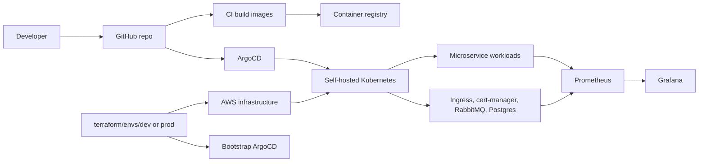
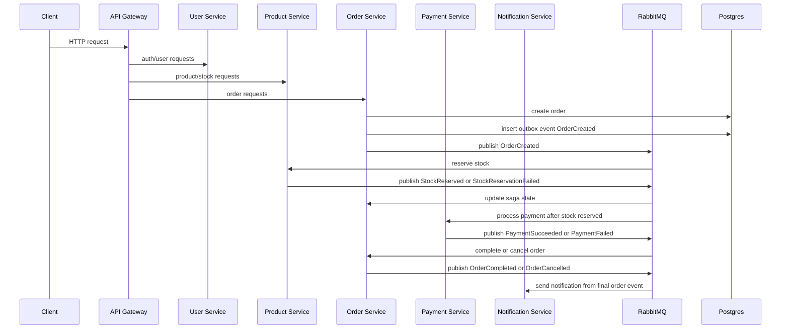

# microservice-reference

Reference structure for an ecommerce microservices system. This repository is
intended to be a blueprint before the implementation files are filled in.

## Goal

Build a production-inspired ecommerce system for learning real microservice
architecture with a small team.

The project uses a monorepo, but each backend service must still behave like an
independent microservice:

- owns its own FastAPI app
- owns its own PostgreSQL database/schema
- owns its own Alembic migrations
- exposes APIs through its own `app/api` layer
- communicates with other services through REST or RabbitMQ events
- must not import another service's business logic directly

## Tech Stack

| Area | Choice |
| --- | --- |
| Backend | FastAPI |
| Frontend | ReactJS |
| Database | PostgreSQL |
| ORM | SQLAlchemy |
| Migration | Alembic |
| Message broker | RabbitMQ |
| API gateway | Nginx |
| Local runtime | Docker Compose |
| Cloud infra | AWS |
| Infrastructure as Code | Terraform |
| Cluster runtime | Self-hosted Kubernetes |
| GitOps | ArgoCD |
| Monitoring | Prometheus, Grafana |

## Architecture Boundary

| Boundary | Owner | Allowed responsibilities | Must not do |
| --- | --- | --- | --- |
| `api-gateway` | Gateway layer | Route frontend traffic to backend services, centralize public HTTP entrypoints. | Hold business logic or own business data. |
| `user-service` | Identity boundary | Register, login, issue JWT, user profile, roles. | Query order/product/payment database directly. |
| `product-service` | Catalog and inventory boundary | Product CRUD, category CRUD, stock reservation, stock release. | Manage order status or payment decisions. |
| `order-service` | Order lifecycle boundary | Create order, store item snapshot, orchestrate saga, maintain order read model. | Charge payment directly or mutate product stock directly. |
| `payment-service` | Payment boundary | Fake payment processing, payment status, payment result events. | Own order lifecycle or stock state. |
| `notification-service` | Notification boundary | Consume business events and send fake email/log notifications. | Become the source of truth for order/payment/product state. |
| `frontend/react-app` | UI boundary | User-facing screens and API calls through gateway. | Call internal service containers directly in production-like flow. |
| `libs/common` | Technical shared library | Logging, config helpers, exceptions, pagination, response envelope. | Contain business rules or database models. |
| `libs/contracts` | Contract shared library | Event payloads, DTOs, shared enums. | Import service internals or implement workflows. |
| `terraform` | Cloud infrastructure boundary | Provision AWS network, compute, IAM, DNS, and cluster bootstrap resources. | Deploy application business workloads directly. |
| `deploy` | Kubernetes/GitOps boundary | Store Kubernetes manifests, ArgoCD apps, and Helm values. | Contain application source code or Terraform state. |
| `observability` | Monitoring boundary | Store Prometheus rules/alerts and Grafana dashboards/datasources. | Own service business metrics definitions hidden inside one service only. |

## Database Boundary

Each service owns a separate database. Cross-service joins are not allowed.

| Service | Database | Main tables |
| --- | --- | --- |
| `user-service` | `user_db` | `users` |
| `product-service` | `product_db` | `products`, `categories`, `stock_reservations`, `outbox_events` |
| `order-service` | `order_db` | `orders`, `order_items`, `order_read_models`, `outbox_events` |
| `payment-service` | `payment_db` | `payments`, `outbox_events` |
| `notification-service` | `notification_db` | `notifications` |

## Design Patterns

| Pattern | Where it applies | How to apply in this repo |
| --- | --- | --- |
| API Gateway | `apps/api-gateway` | Nginx routes external HTTP requests to service APIs. |
| Database per Service | All backend services | Each service has its own `app/infrastructure/database` and Alembic folder. |
| DDD tactical structure | All backend services | Keep `domain`, `application`, `infrastructure`, `schemas`, and `api` separated. |
| Repository Pattern | All backend services | Define repository contracts in `domain/repositories.py`; implement DB access in `infrastructure/repositories`. |
| Service Layer | All backend services | Put use-case orchestration in `application/services`. |
| CQRS | Mainly `order-service` | Commands mutate order state; queries read from `order_read_models`. |
| Saga Orchestration | `order-service` | `application/sagas/order_saga.py` coordinates stock reservation, payment, completion/cancellation. |
| Event-driven Architecture | Product, order, payment, notification | Publish/consume business events through RabbitMQ, not direct imports. |
| Outbox Pattern | Services that publish events | Write business data and `outbox_events` in one DB transaction; publisher later sends events to RabbitMQ. |
| DTO / Schema Pattern | All service APIs | Keep request/response shapes in `app/schemas`. |
| Dependency Injection | All FastAPI services | Wire DB sessions, repositories, and services through FastAPI dependencies. |
| Idempotent Consumer | Event consumers | Handlers must tolerate duplicated RabbitMQ messages. |
| GitOps | `deploy/argocd` | ArgoCD syncs Kubernetes desired state from this repo into the cluster. |
| Infrastructure as Code | `terraform` | Terraform provisions AWS resources and bootstraps the self-hosted Kubernetes platform. |
| Observability as Code | `observability`, `deploy/helm-values` | Prometheus/Grafana config is versioned with the repo. |

## RabbitMQ Event Flow

RabbitMQ is used for business workflows that cross service boundaries. REST is
still fine for simple queries and synchronous gateway-to-service calls.

| Event | Publisher | Consumer | Purpose |
| --- | --- | --- | --- |
| `UserRegistered` | `user-service` | `notification-service` | Send welcome notification or audit log. |
| `OrderCreated` | `order-service` | `product-service`, `payment-service` | Start order workflow after order is created. |
| `StockReserved` | `product-service` | `order-service` | Continue saga when inventory is reserved. |
| `StockReservationFailed` | `product-service` | `order-service` | Cancel order when stock cannot be reserved. |
| `PaymentSucceeded` | `payment-service` | `order-service`, `notification-service` | Complete order and notify user. |
| `PaymentFailed` | `payment-service` | `order-service`, `product-service`, `notification-service` | Cancel order and release stock. |
| `OrderCompleted` | `order-service` | `notification-service` | Send completion notification. |
| `OrderCancelled` | `order-service` | `product-service`, `notification-service` | Release stock if needed and notify user. |

## Request and Event Rules

- Frontend calls the API gateway.
- API gateway routes to backend services through HTTP.
- Service-to-service business workflow should prefer events.
- Services can use REST for simple reads when the caller needs an immediate answer.
- A service must never import another service's `domain`, `application`, or `infrastructure` code.
- Shared code must live only in `libs/common` or `libs/contracts`.
- Events should be defined in `libs/contracts/events` before services consume them.
- Commands change state; queries read state.

## Cloud and Platform Boundary

The repo can support both local development and self-hosted cloud deployment.
Keep those concerns separate:

| Area | Path | Responsibility |
| --- | --- | --- |
| Local development | `docker-compose.yml`, `infrastructure` | Run services and dependencies locally for fast development. |
| AWS provisioning | `terraform` | Create VPC, security groups, EC2 Kubernetes nodes, IAM, DNS, and bootstrap resources. |
| Kubernetes desired state | `deploy/k8s` | Store service manifests, Kustomize bases, and environment overlays. |
| GitOps control plane | `deploy/argocd` | Define ArgoCD projects and applications. |
| Platform Helm config | `deploy/helm-values` | Keep values for ingress-nginx, cert-manager, Prometheus, Grafana, RabbitMQ, and Postgres. |
| Monitoring assets | `observability` | Keep alert rules, recording rules, datasources, and dashboards. |

Terraform should stop at infrastructure and bootstrap. App rollout should be
handled by ArgoCD from `deploy/`, so the cluster state stays Git-driven.

## Deployment Flow



## Platform Rules

- Terraform manages AWS resources, not application release cycles.
- ArgoCD owns Kubernetes sync after bootstrap.
- `deploy/k8s/base` contains reusable manifests.
- `deploy/k8s/overlays/dev` and `deploy/k8s/overlays/prod` contain environment-specific patches.
- `deploy/helm-values` contains platform component values, not app source code.
- `observability` contains dashboards and alerting assets that should be reviewed like code.
- Secrets should not be committed; use sealed secrets, external secrets, or a managed secret flow later.

## Structure Tree

```text
ecommerce-microservices/
|-- README.md
|-- docker-compose.yml
|-- .env.example
|-- Makefile
|
|-- terraform/
|   |-- envs/
|   |   |-- dev/
|   |   `-- prod/
|   `-- modules/
|       |-- vpc/
|       |-- security-groups/
|       |-- ec2-k8s-node/
|       |-- iam/
|       `-- route53/
|
|-- deploy/
|   |-- k8s/
|   |   |-- base/
|   |   |   |-- api-gateway/
|   |   |   |-- user-service/
|   |   |   |-- product-service/
|   |   |   |-- order-service/
|   |   |   |-- payment-service/
|   |   |   |-- notification-service/
|   |   |   `-- frontend/
|   |   `-- overlays/
|   |       |-- dev/
|   |       `-- prod/
|   |-- argocd/
|   |   |-- projects/
|   |   `-- applications/
|   `-- helm-values/
|       |-- ingress-nginx/
|       |-- cert-manager/
|       |-- prometheus/
|       |-- grafana/
|       |-- rabbitmq/
|       `-- postgres/
|
|-- observability/
|   |-- prometheus/
|   |   |-- rules/
|   |   `-- alerts/
|   `-- grafana/
|       |-- dashboards/
|       `-- datasources/
|
|-- apps/
|   |-- api-gateway/
|   |   |-- nginx.conf
|   |   `-- Dockerfile
|   |
|   |-- user-service/
|   |   |-- app/
|   |   |   |-- main.py
|   |   |   |-- api/v1/
|   |   |   |   |-- auth_routes.py
|   |   |   |   `-- user_routes.py
|   |   |   |-- core/
|   |   |   |   |-- config.py
|   |   |   |   |-- security.py
|   |   |   |   `-- logger.py
|   |   |   |-- domain/
|   |   |   |   |-- entities/user.py
|   |   |   |   |-- value_objects/
|   |   |   |   |-- events/user_registered.py
|   |   |   |   `-- repositories.py
|   |   |   |-- application/
|   |   |   |   |-- commands/register_user.py
|   |   |   |   |-- queries/get_user.py
|   |   |   |   |-- handlers/
|   |   |   |   `-- services/auth_service.py
|   |   |   |-- infrastructure/
|   |   |   |   |-- database/
|   |   |   |   |   |-- base.py
|   |   |   |   |   |-- session.py
|   |   |   |   |   `-- models.py
|   |   |   |   |-- repositories/user_repository.py
|   |   |   |   `-- outbox/
|   |   |   `-- schemas/
|   |   |       |-- auth_schema.py
|   |   |       `-- user_schema.py
|   |   |-- alembic/
|   |   |-- tests/
|   |   |-- Dockerfile
|   |   `-- pyproject.toml
|   |
|   |-- product-service/
|   |   |-- app/
|   |   |   |-- main.py
|   |   |   |-- api/v1/
|   |   |   |   |-- product_routes.py
|   |   |   |   |-- category_routes.py
|   |   |   |   `-- stock_routes.py
|   |   |   |-- core/
|   |   |   |-- domain/
|   |   |   |   |-- entities/
|   |   |   |   |   |-- product.py
|   |   |   |   |   `-- category.py
|   |   |   |   |-- events/
|   |   |   |   |   |-- stock_reserved.py
|   |   |   |   |   `-- stock_reservation_failed.py
|   |   |   |   `-- repositories.py
|   |   |   |-- application/
|   |   |   |   |-- commands/
|   |   |   |   |   |-- create_product.py
|   |   |   |   |   |-- reserve_stock.py
|   |   |   |   |   `-- release_stock.py
|   |   |   |   |-- queries/
|   |   |   |   |   |-- list_products.py
|   |   |   |   |   `-- get_product.py
|   |   |   |   `-- services/product_service.py
|   |   |   |-- infrastructure/
|   |   |   |   |-- database/
|   |   |   |   |   |-- base.py
|   |   |   |   |   |-- session.py
|   |   |   |   |   `-- models.py
|   |   |   |   |-- repositories/
|   |   |   |   |-- broker/
|   |   |   |   `-- outbox/
|   |   |   `-- schemas/
|   |   |-- alembic/
|   |   |-- tests/
|   |   |-- Dockerfile
|   |   `-- pyproject.toml
|   |
|   |-- order-service/
|   |   |-- app/
|   |   |   |-- main.py
|   |   |   |-- api/v1/order_routes.py
|   |   |   |-- core/
|   |   |   |-- domain/
|   |   |   |   |-- entities/
|   |   |   |   |   |-- order.py
|   |   |   |   |   `-- order_item.py
|   |   |   |   |-- events/
|   |   |   |   |   |-- order_created.py
|   |   |   |   |   |-- order_completed.py
|   |   |   |   |   `-- order_cancelled.py
|   |   |   |   `-- repositories.py
|   |   |   |-- application/
|   |   |   |   |-- commands/
|   |   |   |   |   |-- create_order.py
|   |   |   |   |   |-- cancel_order.py
|   |   |   |   |   `-- complete_order.py
|   |   |   |   |-- queries/
|   |   |   |   |   |-- get_order.py
|   |   |   |   |   `-- list_user_orders.py
|   |   |   |   |-- handlers/
|   |   |   |   |   |-- stock_reserved_handler.py
|   |   |   |   |   |-- payment_succeeded_handler.py
|   |   |   |   |   `-- payment_failed_handler.py
|   |   |   |   `-- sagas/order_saga.py
|   |   |   |-- infrastructure/
|   |   |   |   |-- database/
|   |   |   |   |   |-- base.py
|   |   |   |   |   |-- session.py
|   |   |   |   |   `-- models.py
|   |   |   |   |-- repositories/
|   |   |   |   |-- broker/
|   |   |   |   `-- outbox/
|   |   |   `-- schemas/
|   |   |-- alembic/
|   |   |-- tests/
|   |   |-- Dockerfile
|   |   `-- pyproject.toml
|   |
|   |-- payment-service/
|   |   |-- app/
|   |   |   |-- main.py
|   |   |   |-- api/v1/payment_routes.py
|   |   |   |-- domain/
|   |   |   |   |-- entities/payment.py
|   |   |   |   |-- events/
|   |   |   |   |   |-- payment_succeeded.py
|   |   |   |   |   `-- payment_failed.py
|   |   |   |   `-- repositories.py
|   |   |   |-- application/
|   |   |   |   |-- commands/process_payment.py
|   |   |   |   |-- handlers/order_created_handler.py
|   |   |   |   `-- services/payment_service.py
|   |   |   |-- infrastructure/
|   |   |   |   |-- database/
|   |   |   |   |   |-- base.py
|   |   |   |   |   |-- session.py
|   |   |   |   |   `-- models.py
|   |   |   |   |-- repositories/
|   |   |   |   |-- broker/
|   |   |   |   `-- outbox/
|   |   |   `-- schemas/
|   |   |-- alembic/
|   |   |-- tests/
|   |   `-- Dockerfile
|   |
|   `-- notification-service/
|       |-- app/
|       |   |-- main.py
|       |   |-- application/handlers/
|       |   |-- infrastructure/
|       |   |   |-- database/
|       |   |   `-- broker/
|       |   `-- schemas/
|       |-- alembic/
|       |-- tests/
|       `-- Dockerfile
|
|-- frontend/
|   `-- react-app/
|       |-- src/
|       |   |-- api/
|       |   |-- pages/
|       |   |-- components/
|       |   |-- hooks/
|       |   |-- stores/
|       |   `-- main.tsx
|       `-- package.json
|
|-- libs/
|   |-- common/
|   |   |-- config/
|   |   |-- logging/
|   |   |-- exceptions/
|   |   |-- pagination/
|   |   `-- response/
|   `-- contracts/
|       |-- events/
|       |   |-- order_events.py
|       |   |-- payment_events.py
|       |   `-- stock_events.py
|       |-- enums/
|       `-- dto/
|
|-- infrastructure/
|   |-- nginx/nginx.conf
|   |-- postgres/init.sql
|   |-- rabbitmq/definitions.json
|   `-- scripts/
|       |-- create-dbs.sql
|       `-- wait-for-it.sh
|
`-- docs/
    |-- architecture.md
    |-- event-catalog.md
    |-- api-contracts.md
    |-- sequence-diagrams.md
    |-- platform.md
    |-- gitops.md
    |-- observability.md
    |-- saga-flow.md
    `-- db-schema.md
```

## Graph View

```mermaid
flowchart TB
    Root["ecommerce-microservices"]

    Root --> Compose["docker-compose.yml"]
    Root --> Env[".env.example"]
    Root --> Makefile["Makefile"]
    Root --> Apps["apps"]
    Root --> Frontend["frontend/react-app"]
    Root --> Libs["libs"]
    Root --> Infra["infrastructure"]
    Root --> Terraform["terraform"]
    Root --> Deploy["deploy"]
    Root --> Observability["observability"]
    Root --> Docs["docs"]

    Apps --> Gateway["api-gateway"]
    Apps --> User["user-service"]
    Apps --> Product["product-service"]
    Apps --> Order["order-service"]
    Apps --> Payment["payment-service"]
    Apps --> Notification["notification-service"]

    Gateway --> NginxGateway["nginx.conf"]

    User --> UserAPI["api/v1"]
    User --> UserDomain["domain"]
    User --> UserApp["application"]
    User --> UserInfra["infrastructure"]

    Product --> ProductAPI["api/v1"]
    Product --> ProductDomain["domain"]
    Product --> ProductApp["application"]
    Product --> ProductInfra["infrastructure"]

    Order --> OrderAPI["api/v1"]
    Order --> OrderDomain["domain"]
    Order --> OrderApp["application"]
    Order --> OrderInfra["infrastructure"]
    OrderApp --> Saga["sagas/order_saga.py"]

    Payment --> PaymentAPI["api/v1"]
    Payment --> PaymentDomain["domain"]
    Payment --> PaymentApp["application"]
    Payment --> PaymentInfra["infrastructure"]

    Notification --> NotificationHandlers["application/handlers"]
    Notification --> NotificationInfra["infrastructure"]

    Libs --> Common["common helpers"]
    Libs --> Contracts["contracts/events/dto"]

    Infra --> Nginx["nginx"]
    Infra --> Postgres["postgres"]
    Infra --> RabbitMQ["rabbitmq"]
    Infra --> Scripts["scripts"]

    Terraform --> AwsInfra["AWS infra"]
    Deploy --> K8s["k8s manifests"]
    Deploy --> ArgoCD["argocd"]
    Deploy --> HelmValues["helm-values"]
    Observability --> PrometheusCfg["prometheus rules/alerts"]
    Observability --> GrafanaCfg["grafana dashboards/datasources"]

    UserApp -. uses .-> Contracts
    ProductApp -. publishes stock events .-> Contracts
    OrderApp -. consumes/publishes events .-> Contracts
    PaymentApp -. publishes payment events .-> Contracts
    NotificationHandlers -. consumes events .-> Contracts

    Compose --> Gateway
    Compose --> User
    Compose --> Product
    Compose --> Order
    Compose --> Payment
    Compose --> Notification
    Compose --> Postgres
    Compose --> RabbitMQ
    Terraform -. provisions .-> AwsInfra
    ArgoCD -. syncs .-> K8s
    HelmValues -. configures .-> PrometheusCfg
    HelmValues -. configures .-> GrafanaCfg
```



## Folder Purpose

| Path | Purpose |
| --- | --- |
| `apps/api-gateway` | Reverse proxy entrypoint for routing client traffic to backend services. |
| `apps/*-service/app/api` | HTTP routes for each service. |
| `apps/*-service/app/domain` | Business entities, domain events, and repository contracts. |
| `apps/*-service/app/application` | Commands, queries, handlers, sagas, and service orchestration. |
| `apps/*-service/app/infrastructure` | Database, broker, repository implementations, and outbox adapters. |
| `apps/*-service/alembic` | Database migrations for the service. |
| `frontend/react-app` | React client application. |
| `libs/common` | Shared config, logging, exception, pagination, and response helpers. |
| `libs/contracts` | Shared event contracts, enums, and DTOs exchanged between services. |
| `infrastructure` | Local runtime support: Nginx, Postgres, RabbitMQ, and helper scripts. |
| `terraform` | AWS infrastructure modules and environment entrypoints. |
| `deploy/k8s` | Kubernetes manifests and Kustomize overlays for workloads. |
| `deploy/argocd` | ArgoCD projects and applications for GitOps sync. |
| `deploy/helm-values` | Helm values for platform services such as ingress, cert-manager, monitoring, RabbitMQ, and Postgres. |
| `observability` | Prometheus rules/alerts and Grafana assets. |
| `docs` | Architecture notes, API contracts, event catalog, saga flow, and database schema. |

## Service Flow



## Standard Service Layout

Each FastAPI service should keep the same internal layout so teammates can move
between services without relearning the folder shape.

| Path | Role |
| --- | --- |
| `app/main.py` | FastAPI application entrypoint. |
| `app/api/v1` | HTTP routes/controllers. |
| `app/core` | Config, logger, security, dependency setup. |
| `app/domain/entities` | Business entities owned by the service. |
| `app/domain/events` | Domain events produced by the service. |
| `app/domain/repositories.py` | Repository interfaces/contracts. |
| `app/application/commands` | Write-side request objects/use cases. |
| `app/application/queries` | Read-side request objects/use cases. |
| `app/application/handlers` | Event handlers and command handlers. |
| `app/application/services` | Use-case orchestration. |
| `app/application/sagas` | Long-running business workflow orchestration, mainly order service. |
| `app/infrastructure/database` | SQLAlchemy base, session, models. |
| `app/infrastructure/repositories` | Concrete repository implementations. |
| `app/infrastructure/broker` | RabbitMQ publisher/consumer adapters. |
| `app/infrastructure/outbox` | Outbox persistence and publisher logic. |
| `app/schemas` | API DTOs/request/response schemas. |
| `alembic` | Service-owned DB migrations. |
| `tests` | Unit/integration tests for the service. |

## Development Phases

| Phase | Focus | Expected result |
| --- | --- | --- |
| 1 | Service setup, CRUD APIs, PostgreSQL, JWT, gateway | Services run independently through Docker Compose. |
| 2 | RabbitMQ, domain events, outbox | Services publish and consume integration events reliably. |
| 3 | Order saga, CQRS, notification service | Full order flow can complete or cancel through events. |
| 4 | Tests, retry, idempotency, logging | System becomes safer for integration work. |
| 5 | Terraform, Kubernetes, ArgoCD, monitoring | AWS self-hosted cluster runs the system through GitOps with Prometheus/Grafana. |

## Team Split

| Area | Suggested owner |
| --- | --- |
| User service, product service, auth, frontend login/product pages | Developer 1 |
| Order service, payment service, RabbitMQ, saga, Docker Compose | Developer 2 |
| API gateway, contracts, docs, integration testing | Shared |

## Notes

Jack Blue was here since SU26.
